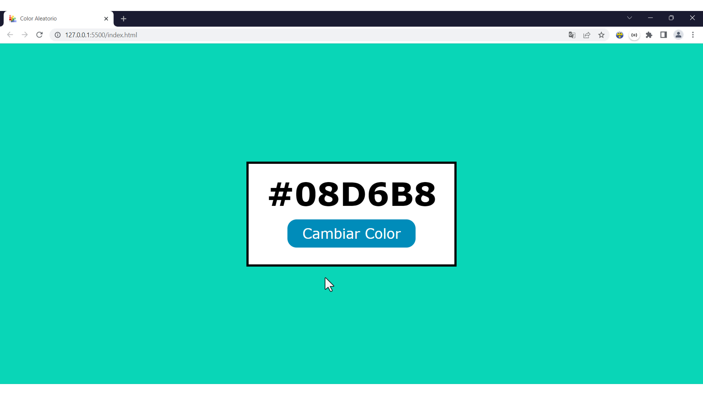
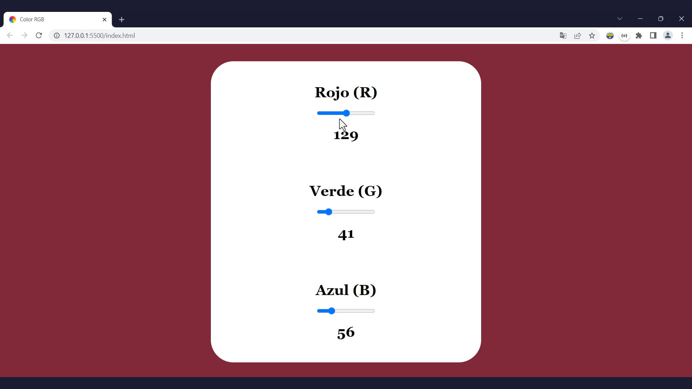
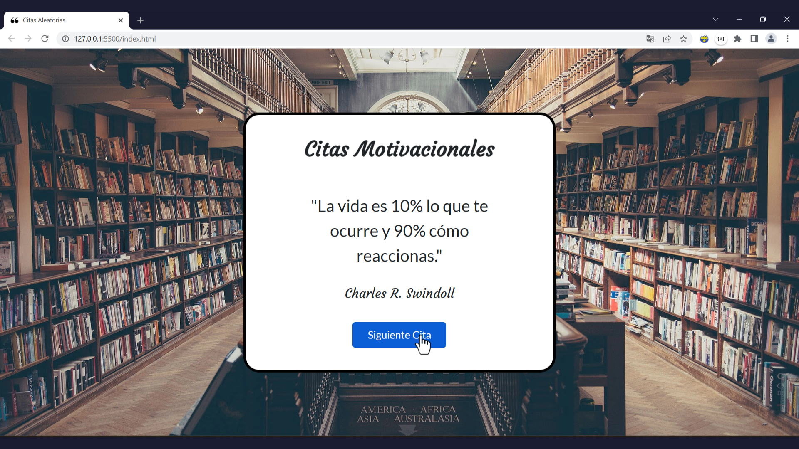
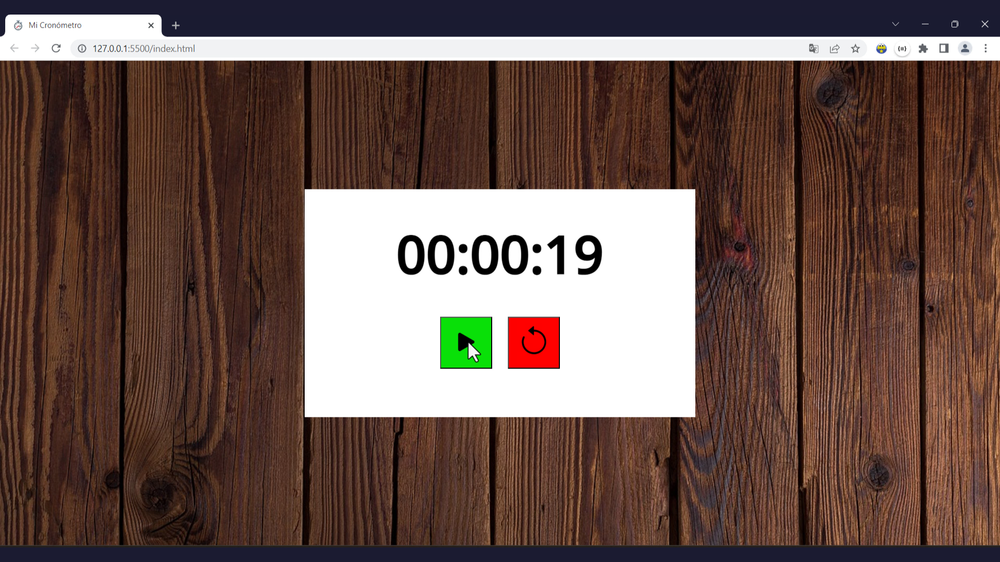
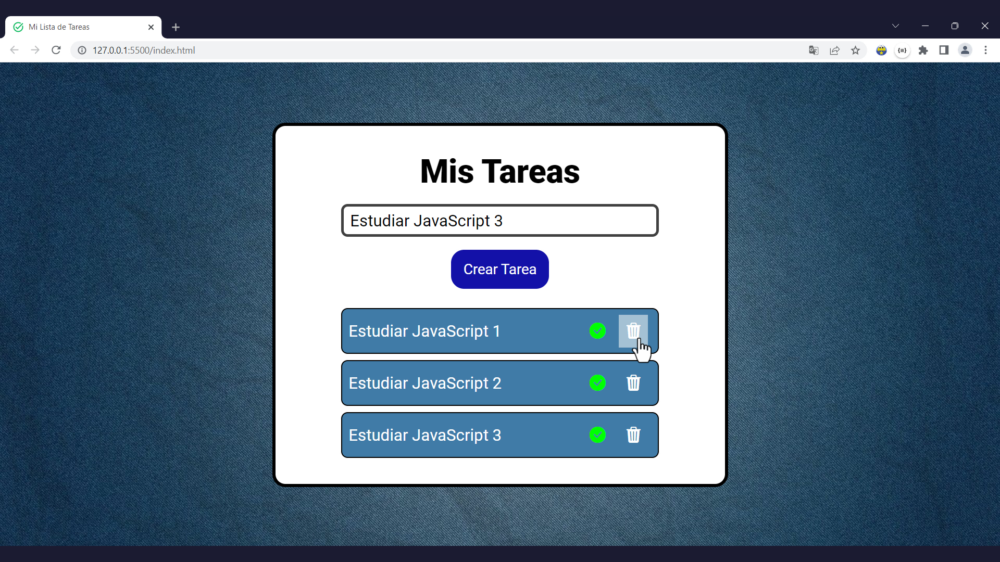

# Curso de JavaScript para Manipulación del DOM

¡Hola! Este repositorio contiene el código de los proyectos que crearemos paso a paso en el curso de JavaScript para manipulación del DOM publicado en el [canal de YouTube de freeCodeCamp en español](https://www.youtube.com/freecodecampespanol).

## Proyectos

### Generador de colores hexadecimales aleatorios

Nuestro primer proyecto será un generador de colores hexadecimales aleatorios. Generaremos un color hexadecimal aleatorio y lo asignaremos como color de fondo del elemento body.

### Selector de colores RGB con controles deslizantes

Nuestro segundo proyecto también tendrá colores, pero esta vez el color no será aleatorio. Será un color RGB y podrás elegir los valores de rojo, verde y azul para generar un nuevo color y actualizar el fondo.

### Generador de citas aleatorias

Nuestro tercer proyecto mostrará una cita aleatoria y su autor. El usuario podrá hacer clic en el botón azul para cambiar la cita y seleccionar una nueva.

### Cronómetro

Nuestro cuarto proyecto será un cronómetro. El usuario podrá iniciar, pausar y detener el cronómetro y actualizar la hora y los iconos de manera adecuada.

### Aplicación de lista de tareas pendientes

Nuestro quinto proyecto será una aplicación de lista de tareas pendientes. El usuario podrá escribir una tarea en el campo de texto y hacer clic en el botón o presionar Entrar en el teclado para agregar la tarea nueva. Las tareas tendrán texto, un botón para marcarlas como completadas y un botón para eliminarlas de la lista. Cada estado actualizará su estilo.

## Curso de JavaScript para manipulación del DOM en YouTube

Puedes encontrar el curso completo y gratuito en el canal de YouTube de freeCodeCamp en español. 

✍️ Curso creado por **Estefania Cassingena Navone** para freeCodeCamp en español.